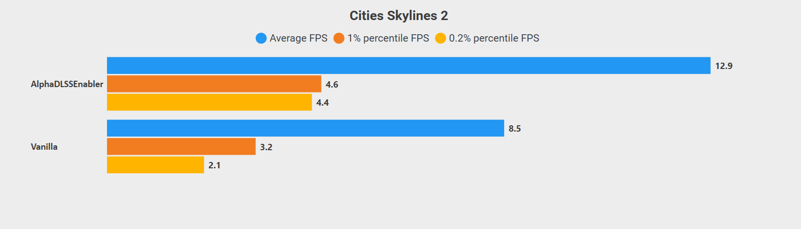
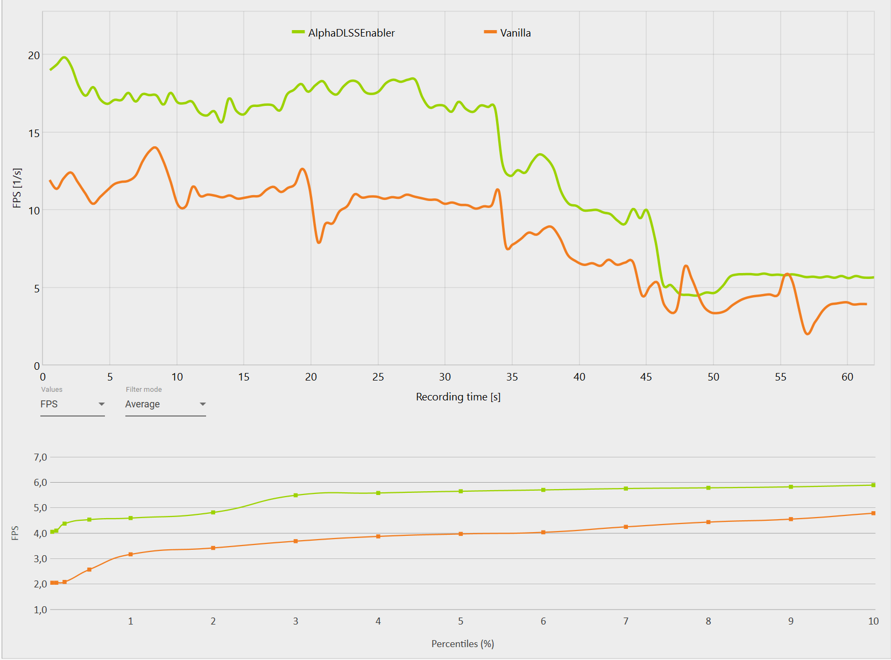

# Cities: Skylines 2 - Alpha DLSS Enabler

This mods enables the experimental DLSS support. WARNING! When I say experimental, I mean it. Bunch of graphical artifacts are introduced when you activate this mod, as it's not properly implemented yet.

Personally I experienced ~10 FPS on average increase. However, performance when viewing citizens is still abysmall and this doesn't seem to help a lot with that particular problem.

The benchmark was made by animating the camera from outside the city to zoomed in one a meeting point of two metro stations with lots of pedestrians.

# Requirements

- [Cities: Skylines 2](https://store.steampowered.com/app/949230/Cities_Skylines_II/) (duh)
- [BepInEx 5.4.22](https://github.com/BepInEx/BepInEx/releases) or later

# Installation

- Make sure BepInEx 5 is installed
- Download latest release from GitHub - [https://github.com/Captain-Of-Coit/cs2-alpha-dlss-enabler/releases](https://github.com/Captain-Of-Coit/cs2-alpha-dlss-enabler/releases)
- Extract the ZIP archive and place the `AlphaDLSSEnabler` directory in `BepInEx\Plugins`
- Launch the game. DLSS will automatically be activated, and can only be disabled by removing the mod.

# Community

Looking to discuss Cities: Skylines 2 Unofficial modding together with other modders? You're welcome to join our "Cities 2 Modding" Discord, which you can find here: https://discord.gg/vd7HXnpPJf